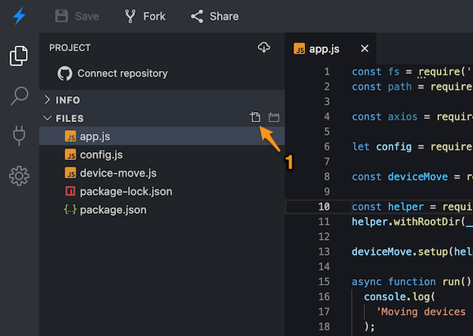
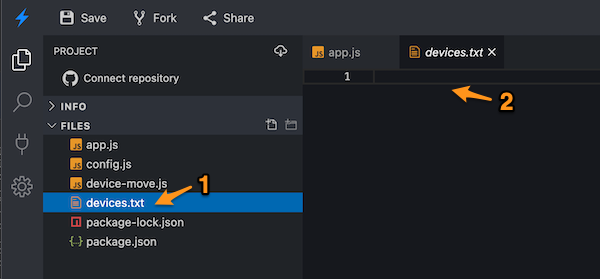

# node-example-device-cloud-setup

*Example script for doing Particle cloud configuration for product devices*

Given a file of Device IDs or serial numbers, or one entered manually from the keyboard or a data matrix scanner, it can optionally do a number of operations:

- Add the device to a product
- Claim the device to an account
- Set the product firmware version (and optionally flash now)
- Set as development device (optional; not typically used)
- Set the device name to the serial number (optional)
- Add a device group, either fixed name or date-based

## Running in a web browser

If you do not want to install node.js, or can't, because you have a managed computer or Chromebook, you can run the tool from the Chrome web browser on Windows, Linux, Mac, and Chromebook. This uses [Stackblitz](https://stackblitz.com) to run a virtual machine and node *in your web browser*.

Open this page in Chrome: [https://stackblitz.com/edit/node-ufhuyk](https://stackblitz.com/edit/node-ufhuyk?file=app.js)

In the Terminal pane in the lower center of the window, enter the command:

```
node app.js
```

As long as you do not save your project, all of the data is stored in your web browser only and will disappear entirely when you close the browser tab. 

If you create a Stackblitz account you can save your project with changes and come back to it later. However, if you are using a free account, be sure to not save any sensitive information like access tokens, because projects in the free account tier are public. By default, the tool does not save access tokens. Only the code and files are saved; any temporary data in memory and the contents of the terminal window are not saved, so you don't have to worry about things you enter interactively even if you save.

Other web browsers will be supported in the future, but this currently only works with Chrome. 


## Installation (locally)

1. If you have not already installed [node.js](https://nodejs.org/), v12 or later. The current LTS is 14.18.1, and the current LTS is the recommended version to use.

2. Download this repository from [Github](https://github.com/particle-iot/node-example-device-cloud-setup). 

3. From a command prompt or terminal window:

```
cd node-exmaple-device-cloud-setup
npm install
node app.js
```

4. If you just run the tool, it will prompt you to log in, select your product.

5. You can also edit config.js to customize the configuration, or edit the source in app.js to really customize the behavior.


## Example usage

```
cd node-example-device-cloud-setup
node app.js
Particle username (account email): user@company.com
Password: (will not display as you type) 
Logged in as user@company.com
Select the product you want to set up devices for
ID    Name               Platform Description                                
15513 test5523           Boron    Boron Test Product                         
Do cloud setup devices for product product ID? 15513
Getting list of devices in product...
Device ID or Serial Number (q to quit): B40H9999999KJV7 H5LM99999999E2U
Setting up e00f999999999997d5cd238...
  Adding to product 15513...
  Claiming device...
  Setting device info...
  Assigning device group 20211013...
  Done!
Device ID or Serial Number (q to quit): q
```


## Using a devices file

If you have received a list of Device IDs from a wholesale order, you can import them using this tool. Create a file devices.txt in the same directory as the app.js file and run the tool as above. 

The file can contain a list of Device IDs (one per line), or it can contain lines with additional information such as ICCIDs and serial numbers. The Device IDs (24 character hex) will be extracted from the file and other information ignored.

### With the web browser version

The web browser version in Stackblitz is essentially Visual Studio Code running in your browser. To create a devices.txt file in the web version:

- Hover over app.js and icons to create a file (1) or directory appear at the top of the list of files. Click **Create file** (1).



- In the file explorer area, enter the filename **devices.txt** (1) and press Return or Enter. Then you can edit the file in editor tab (2). You can copy and paste the list of device IDs there.



## Using a data matrix scanner

It is also possible to use a wireless or USB data matrix scanner. These are sometimes referred to as QR code readers, but the code on Particle devices is a slightly different format (data matrix) instead of QR. However many 2D barcode readers can read both formats.

You'll want a version that either uses USB directly or has a wireless dongle that emulates a USB keyboard.

When you scan a Particle serial number sticker, the code will output either:

- Serial number, then Return (Gen 2)
- Serial number, space, mobile secret, then Return (Gen 3)

The interactive device setup mode will extract the serial number, look it up using the Particle API, and then proceed as if you had entered the Device ID.

## Code Overview

It is possible to use this tool without editing the configuration or code at all; you will be prompted for login and essential things like the product you want to import to interactively from the terminal.

To customize the tool, in many cases you can edit the config.js file. This allows you to pre-configure the product so you don't need to select it every time, as well as control some common scenarios, such as not claiming the devices, not setting the device name, using device groups, etc.. There are comments that explain the settings in the file. 

If the tool is running stop it (Ctrl-C), then run it again (`node app.js`) after editing the config.js file.

Finally, since it's node.js, you can just edit the app.js file to really customize the behavior. For example, if you wanted a different device group name format, or wanted to use a different device name format, you could implement this in custom code. Most of the changes would be in the deviceCloudSetup function near the top of the file.

## Version History

### 0.0.1 (2021-11-14)

- Initial version


